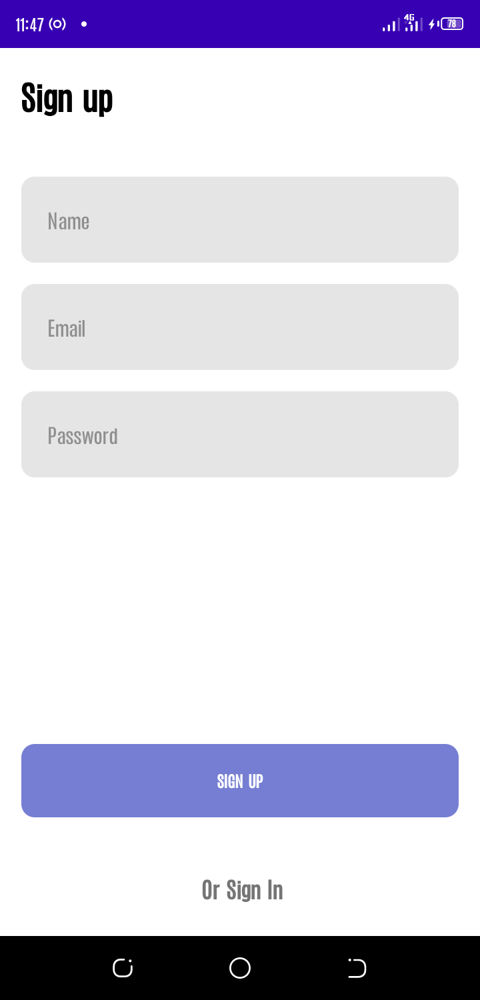
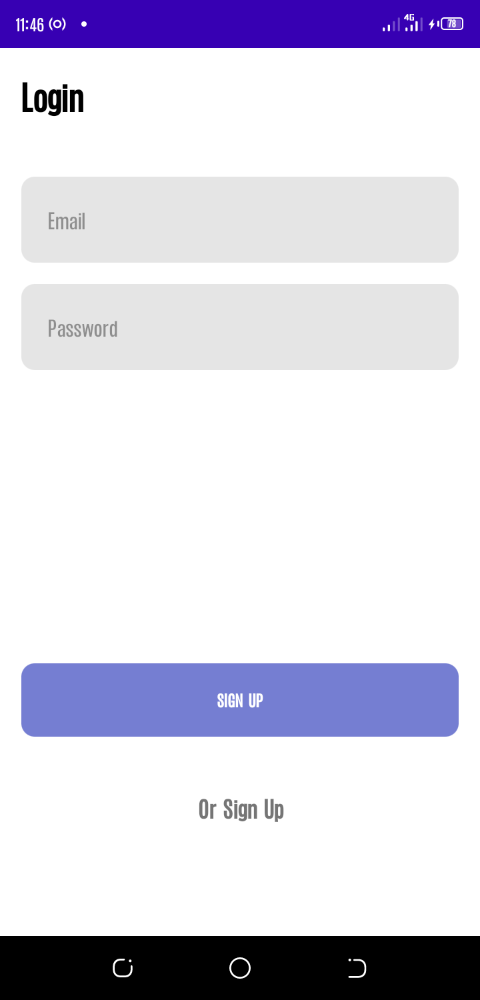
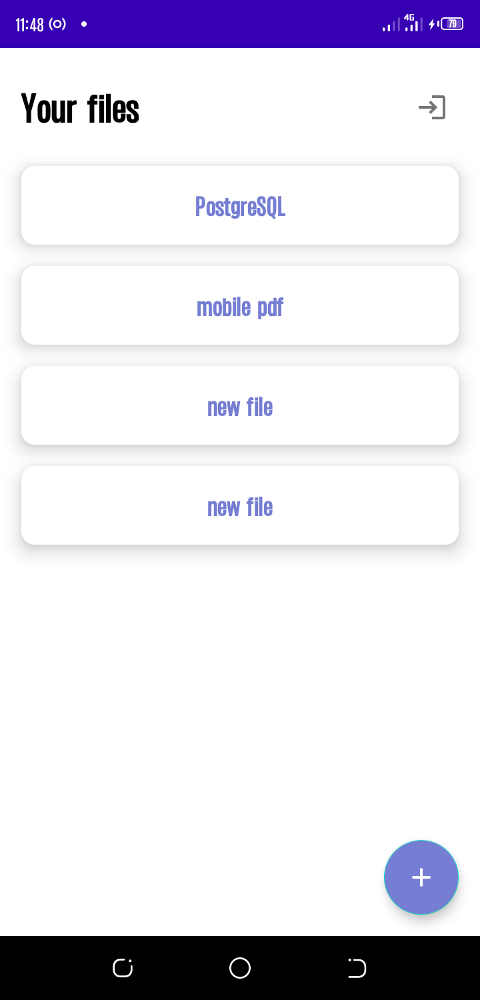
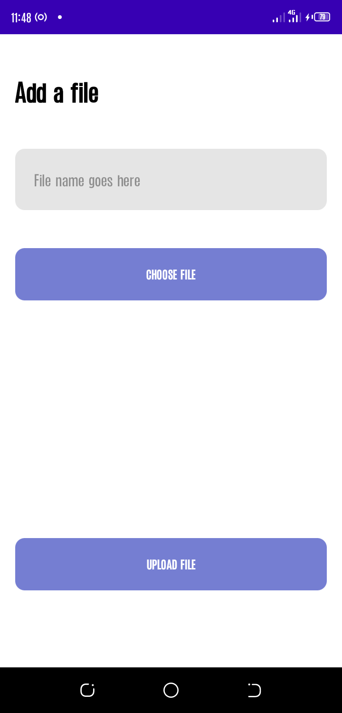

# DroidHub

DroidHub is a simple app that lets users store their files in cloud storage, view and be able to downoad them.
The app uses MVVM architecture
I used the following developement components
* LiveData - lifecycle-aware data holder
* ViewBinding - for easy interaction between code and views
* ViewModel - manage UI's data in a lifecycle-aware fashion

### Prerequisite
To run the project you should have the following tools
* Android Studio 4.0 or above
* Internet connection

### Project Setup
* Clone the project to your local machine
* open in android studio 

### User interface
#### Auth - Registration
The user is presented with Registration Page where he/she is required to Sign Up with email and password.

#### Login
The user is presented with Login Page where he/she is required to Sign In with registered email and password.

#### Home Page
User is directed to Home screen where he/she can view his files stored in cloud storage

#### Add Files Page
User is taken to Add Files page after clicking the floating actio button on Home Page where he/she can select files to upload from his device storage and provide a name for the file. 

